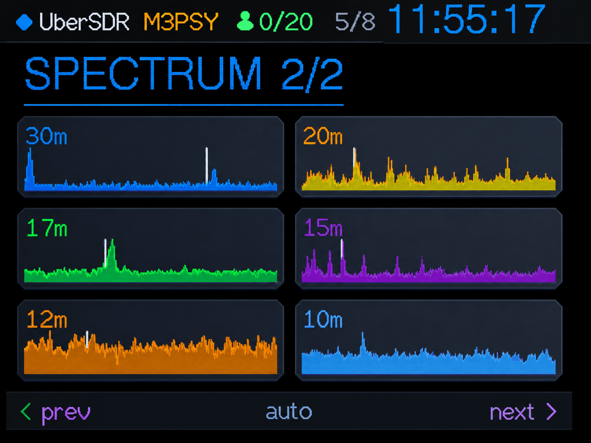

# UberSDR CYD

ESP32-2432S028R ("Cheap Yellow Display") firmware — the display front-end for an UberSDR receiver.



## Getting started

### Option 1 — Flash from your browser (easiest)

**👉 [Open Web Flasher](https://madpsy.github.io/ubersdr_cyd/flash/)**

No toolchain, no drivers, no cloning — flash straight from Chrome or Edge over USB using ESP Web Tools:

1. Plug the CYD into your computer with a USB data cable.
2. Open the web flasher and (optionally) enter your **WiFi credentials** and **UberSDR server details** in the form — they are baked into the flash image locally in your browser, so the display boots straight onto your network showing your instance. Nothing is sent anywhere.
3. Click **Install** and pick the serial port.

If you leave the form blank the device starts the `UberSDR-Setup` hotspot and you configure it on-screen or via browser as described below. Under the hood the baked-in settings are written to a dedicated `usercfg` flash partition which the firmware imports into NVS on first boot and then erases.

### Option 2 — Build from source

#### 1. Clone and configure

```bash
git clone https://github.com/yourname/ubersdr_cyd
cd ubersdr_cyd
cp data/wifi.json.example data/wifi.json
cp data/ubersdr.json.example data/ubersdr.json
```

Edit the two JSON config files (both gitignored, uploaded to the device's LittleFS filesystem):

- **`data/wifi.json`** — WiFi credentials (optional — you can also configure WiFi on-screen or via the setup hotspot, see below):
  ```json
  {
    "ssid": "your-wifi-ssid",
    "password": "your-wifi-password"
  }
  ```
- **`data/ubersdr.json`** — UberSDR server details:
  ```json
  {
    "host": "ubersdr.local",
    "port": 8080,
    "password": "your-admin-password"
  }
  ```

At boot the device resolves each setting in priority order:

1. The JSON file on LittleFS (ignored if it still contains placeholder values).
2. Values saved via the web setup portal or on-screen keyboard (stored in NVS).
3. Compile-time defaults in `include/app_config.h` (last-resort fallback — you normally don't need to touch this file).

The admin password is sent only as the `X-Admin-Password` header to the configured host and is never committed to version control.

#### 2. Build and flash

```bash
./deploy.sh
```

This builds the firmware, uploads it, and uploads the LittleFS filesystem (`data/`, including your JSON config). Other modes:

```bash
./deploy.sh build     # build only (no upload)
./deploy.sh firmware  # build + upload firmware only
./deploy.sh fs        # upload filesystem only (use after editing the JSON config)
```

The upload port comes from `platformio.ini`; override it with `UPLOAD_PORT=/dev/ttyUSB1 ./deploy.sh`. Watch the serial output with `pio device monitor`.

#### Updating the web-flasher binaries (maintainers)

```bash
./build.sh
```

Builds the firmware plus a **clean** LittleFS image (containing only the `.example` config files, never your local credentials) and stages `bootloader.bin` / `partitions.bin` / `boot_app0.bin` / `firmware.bin` / `littlefs.bin` into `docs/flash/`. Commit those and GitHub Pages (serving the `docs/` folder) publishes the updated web flasher.

### Configure WiFi on-screen (if not baked in at flash time)

1. Power on the device.
2. Tap the lower half of the status screen ("Tap here to configure WiFi").
3. Use the on-screen keyboard to enter your SSID, then tap **OK**.
4. Enter your password, then tap **OK**.
5. The device connects and returns to the status screen.

### Configure WiFi via browser (alternative)

1. Connect your phone/laptop to the `UberSDR-Setup` WiFi network (password `ubersdr1`).
2. Open `http://192.168.4.1/` in a browser.
3. Enter your home WiFi credentials and tap **Save settings**.
4. Once the device joins your network the hotspot turns off automatically (unless you tick "Keep hotspot always on").

## Configuring notifications in UberSDR

The display accepts webhook notifications from the UberSDR server and shows them as toast cards (see the Webhook notifications feature below). To set this up on the server:

1. Open the **Notification Admin** — in the UberSDR admin panel, click **🔔 Notifications** (`notifications-admin.html`).
2. Click **+ Add Channel** and set the channel type to **Webhook**.
3. Set **Service Preset** to **Custom**.
4. Set **Webhook URL** to the display's default mDNS name with the `/notify` suffix:
   ```
   http://ubersdr-cyd.local/notify
   ```
   If mDNS isn't working from the server (Go's resolver often won't resolve `.local` names), use the display's IP address instead: `http://<display-ip>/notify`.
5. Set **Payload Format** to **JSON**.
6. Save the channel, then create or edit notification rules to send to it.

You can verify the display side independently of the server with:

```bash
curl "http://ubersdr-cyd.local/notify?msg=hello"
```

## Hardware

| Board | ESP32-2432S028R (CYD) |
|---|---|
| Display | ILI9341 320×240 TFT (landscape) |
| Touch | XPT2046 (separate HSPI bus) |
| MCU | ESP32 (240 MHz dual-core) |

## Features

- **Overview slideshow** — polls the UberSDR server's HTTP API and cycles through modern, full-colour metric slides on the 320×240 display. Auto-advances every 8 s; tap left/right to step slides manually, tap the centre to pause/resume, tap the top edge to return to the status screen. Slides included:
  - **Users** — current / max connected users, capacity bar, free slots, bypass users and session count, plus a network-throughput card (total / audio / waterfall kbps) when the server supports `/admin/sessions?compact=1`.
  - **System Load** — 1/5/15-minute load averages (colour-coded vs core count) and CPU temperature gauge.
  - **Band Conditions** — colour-coded pill grid of per-band FT8 SNR quality (EXCELLENT/GOOD/FAIR/POOR).
  - **Spectrum** — a grid of live per-band FFT mini-charts (6 per page, each a distinct colour), sorted by ascending centre frequency. Spans multiple pages that share the slide's 8-second window.
  - **Space Weather** — propagation quality banner plus K-index, A-index and solar flux cards.
  - **Weather** — local terrestrial conditions (description, temperature, humidity, pressure, wind) from the instance's location.
  - **Antenna** — live antenna-switch state (active port label or GROUNDED) and a rotator compass dial with azimuth + 16-point bearing. Only shown when the server reports an enabled antenna switch or a connected rotator.
  - **Ranking** — PSKReporter spots/DXCC rank, WSPR Live rank (24h / today / yesterday) and RBN skimmer rank, laid out in 1–3 columns depending on which sources report data.
  - **GPSDO** — GPS-disciplined oscillator status: PLL/GPS lock indicators, fix mode, satellites used, HDOP, altitude and UTC time from the GPS receiver. Only shown when the server reports a GPSDO.
  - **Health** — per-component monitor-health grid (page 0: overall status banner + colour-coded dot grid; pages 1+: one detail page per unhealthy component listing its issue strings). Only shown when the server reports health data.

The header shows the instance callsign, a live **user-count chip** (`1/20`, green normally, amber at capacity), the slide counter, and a clock with the **UberSDR instance's local time** (derived from `receiver.timezone_offset` in `/api/description`), falling back to UTC until that offset is known.
- **Webhook notifications** — the display exposes `POST /notify` (port 80, LAN-only, no auth) for UberSDR's Generic-webhook notification channel. Incoming messages appear as a toast card overlaid on the bottom of the screen for ~6 s each (up to 6 queued, "+N" badge, tap to dismiss; slide auto-advance pauses while a toast is up). The toast title uses the JSON payload's `rule` name when present, then `event`, then `channel`. Accepts `webhook_format: text` or `json` (also Slack/Discord shapes), plus `?msg=…` on GET for testing:
  ```bash
  curl "http://ubersdr-cyd.local/notify?msg=hello"
  ```
  Server-side setup is described in [Configuring notifications in UberSDR](#configuring-notifications-in-ubersdr) above.
- **Health status LED** — the onboard RGB LED reflects the UberSDR monitor-health overall status in real time: blue while waiting for data, green when all components are healthy, amber on warnings, red on critical alerts. See [Onboard RGB LED](#onboard-rgb-led--health-status-indicator) for the full colour table.
- **On-screen WiFi setup** — tap the screen to open a touch keyboard and enter your SSID and password directly on the display. No phone or laptop needed.
- **Setup hotspot** — the device also broadcasts `UberSDR-Setup` (password `ubersdr1`) so you can configure WiFi from a browser at `192.168.4.1` or `http://ubersdr-cyd.local/` once connected. (mDNS name is `ubersdr-cyd` to avoid clashing with the UberSDR server's own `ubersdr.local`.)
- **Debug log** — a rolling 100-line log of API polls and results is served at `http://<display-ip>/debug` (or `http://ubersdr-cyd.local/debug`), auto-refreshing every 3 seconds.
- **NVS persistence** — credentials and brightness are stored in ESP32 NVS flash and survive reboots.
- **Factory reset** — hold the BOOT button (GPIO 0, back of board) for 5 seconds to wipe all settings.
- **Status screen** — shows WiFi status, IP address, NTP sync, and uptime. Tap the header to open the overview slideshow.

### Extensible slide architecture

Each slide is a self-contained module (`src/slide_<name>.{h,cpp}`) deriving from the `Slide` base class in [`src/slide_base.h`](src/slide_base.h). To add a new slide:

1. Create `src/slide_<name>.{h,cpp}` implementing `name()`, `draw()` and (optionally) `hasData()`.
2. Register one instance in the `kSlides[]` table in [`src/slideshow.cpp`](src/slideshow.cpp).

Slides with no data are skipped automatically in the rotation. A slide may also
paginate: override `pageCount()` to return >1 and implement `setPage()`, and the
slideshow will split the slide's on-screen window evenly across its pages (e.g.
the Spectrum slide shows 6 band charts per page).

## Architecture / real-time design

### FreeRTOS task model

The ESP32 runs FreeRTOS. The Arduino `loop()` executes as a task on **Core 1**. A second task, `ubersdr_api`, is pinned to **Core 0** (where the WiFi/TCP stack also lives) and handles all HTTP polling. This keeps the display loop on Core 1 completely free of network I/O, so the clock and touch response are never delayed by a slow or unreachable server.

```
Core 0                              Core 1
──────────────────────────────      ──────────────────────────────
ubersdr_api task                    Arduino loop()
  ├─ httpGet() — up to 4 s           ├─ setupPortalLoop()
  ├─ parse JSON                       ├─ connectivityLoop()
  ├─ write g_work (no mutex)          ├─ displayUpdate()
  ├─ [mutex] g_snap = g_work          │    ├─ slideshowTick()  ← clock
  └─ vTaskDelay(2 s)                  │    │    └─ [mutex] copy g_snap
                                      │    └─ slideshowDraw()
                                      └─ delay(10 ms)
```

### Double-buffer snapshot

`ubersdr_api.cpp` maintains two `UberSDRSnapshot` structs:

| Buffer | Written by | Protected by |
|---|---|---|
| `g_work` | API task (Core 0) during HTTP fetch | nothing — only one writer |
| `g_snap` | API task (Core 0) after each step | `g_snapMutex` |

After each HTTP step completes, the API task takes the mutex for a ~1 µs `g_snap = g_work` copy, then immediately releases it. Core 1 calls `getUberSDRSnapshot()` which takes the same mutex only long enough to copy `g_snap` into a local value. The mutex is **never held during network I/O**, so Core 1 is never blocked for more than a few microseconds.

### Clock accuracy

The header clock is drawn in-place (no full-screen clear) by [`slideshowTick()`](src/slideshow.cpp) every time `millis()` advances past the next 1-second boundary. Because `loop()` on Core 1 is never blocked by HTTP, the tick fires within a few milliseconds of the correct second.

### API failure toasts

The API task tracks consecutive poll failures. After 6 failures (~12 s) it sets `volatile bool g_apiWentDown = true`. On recovery it sets `g_apiWentUp = true`. These flags are consumed by `displayUpdate()` on Core 1, which calls `notificationsPush()` to show a toast. All UI calls stay on Core 1; the API task never touches the notification queue directly.

### Debug endpoint

`GET /debug/tasks` returns a JSON object with:
- `api_task_hwm_bytes` — stack high-water mark of the `ubersdr_api` task (sampled every 30 s inside the task via `uxTaskGetStackHighWaterMark()`)
- `free_heap_bytes` / `min_free_heap_bytes` — current and all-time minimum free heap

## Polled API endpoints

The overview slideshow polls these endpoints round-robin, one every 2 s (~20 s full cycle):

| Endpoint | Auth | Used for |
|---|---|---|
| `GET /api/description` | none | capacity, user count, callsign, timezone, antenna/rotator |
| `GET /admin/sessions?compact=1` | `X-Admin-Password` | user / bypass counts + network throughput (falls back to parsing the full per-session payload on older servers) |
| `GET /admin/system-load` | `X-Admin-Password` | load averages + CPU temperature |
| `GET /api/noisefloor/latest` | none | per-band FT8 SNR (band conditions) |
| `GET /api/noisefloor/fft?band=…` | none | per-band spectrum charts (one band per cycle) |
| `GET /api/spaceweather` | none | K/A index + solar flux |
| `GET /api/weather` | none | terrestrial weather |
| `GET /admin/psk-rank` | `X-Admin-Password` | PSKReporter spots + DXCC rank |
| `GET /admin/wspr-rank` | `X-Admin-Password` | WSPR Live rank |
| `GET /admin/rbn-data` | `X-Admin-Password` | RBN skimmer rank |
| `GET /admin/gpsdo-health` | `X-Admin-Password` | GPSDO lock + GPS fix status |
| `GET /admin/monitor-health` | `X-Admin-Password` | Per-component health grid + RGB LED state |

## Project structure

```
ubersdr_cyd/
├── data/                     # LittleFS filesystem image (uploaded to the device)
│   ├── wifi.json.example     # Template — copy to wifi.json (gitignored)
│   └── ubersdr.json.example  # Template — copy to ubersdr.json (gitignored)
├── deploy.sh                 # Build + upload firmware and filesystem over USB
├── build.sh                  # Build + stage web-flasher binaries into docs/flash/
├── docs/
│   └── flash/                # Browser-based flasher (GitHub Pages + ESP Web Tools)
├── partitions.csv            # Flash layout (incl. usercfg partition for the web flasher)
├── include/
│   ├── User_Setup.h          # TFT_eSPI pin/driver config for CYD
│   ├── app_config.example.h  # Template — copy to app_config.h
│   └── app_config.h          # Optional compile-time defaults (gitignored)
├── src/
│   ├── main.cpp
│   ├── settings.{h,cpp}      # NVS-backed settings store
│   ├── connectivity.{h,cpp}  # WiFi + NTP
│   ├── setup_portal.{h,cpp}  # AP hotspot + web config portal
│   ├── display.{h,cpp}       # TFT + touch + on-screen keyboard + status screen
│   ├── reset_button.{h,cpp}  # BOOT button factory reset
│   ├── ubersdr_api.{h,cpp}   # UberSDR HTTP poller → UberSDRSnapshot
│   ├── slideshow.{h,cpp}     # slide registry, auto-advance, touch dispatch
│   ├── slide_base.{h,cpp}    # Slide interface + shared draw helpers/palette
│   ├── slide_users.{h,cpp}   # Users & capacity slide
│   ├── slide_load.{h,cpp}    # System load & CPU temp slide
│   ├── slide_bands.{h,cpp}   # Band-conditions pill grid slide
│   ├── slide_spaceweather.{h,cpp}  # Space-weather slide
│   ├── slide_weather.{h,cpp}       # Terrestrial weather slide
│   ├── slide_antenna.{h,cpp}       # Antenna-switch + rotator compass slide
│   ├── slide_spectrum.{h,cpp}      # Per-band FFT mini-chart grid (paged)
│   ├── slide_ranking.{h,cpp}       # PSKReporter / WSPR / RBN ranking slide
│   ├── slide_gpsdo.{h,cpp}         # GPSDO lock + GPS fix status slide
│   ├── slide_health.{h,cpp}        # Monitor-health dot grid + detail pages slide
│   ├── status_led.{h,cpp}          # Onboard RGB LED health-status indicator
│   ├── notifications.{h,cpp}       # Webhook toast queue + overlay renderer
│   └── debug_log.{h,cpp}           # Rolling debug log served at /debug
└── platformio.ini
```

## Wiring / pin reference

All pins are fixed by the CYD board — no external wiring needed.

| Signal | GPIO |
|---|---|
| TFT MOSI | 13 |
| TFT SCLK | 14 |
| TFT CS | 15 |
| TFT DC | 2 |
| TFT MISO | 12 |
| TFT BL | 21 |
| Touch SCLK | 25 |
| Touch MOSI | 32 |
| Touch MISO | 39 |
| Touch CS | 33 |
| Touch IRQ | 36 |
| BOOT button | 0 |
| RGB LED Red | 4 |
| RGB LED Green | 16 |
| RGB LED Blue | 17 |

### Onboard RGB LED — health status indicator

The CYD has a common-anode RGB LED (active-LOW) driven by [`src/status_led.cpp`](src/status_led.cpp). It reflects the UberSDR `/admin/monitor-health` overall status:

| LED colour | Meaning |
|---|---|
| 🔵 Blue | Waiting for first health data (device just booted or API unreachable) |
| 🟢 Green | All components healthy (`healthOverall == 0`) |
| 🟡 Amber (red + green) | At least one component in WARNING state (`healthOverall == 1`) |
| 🔴 Red | At least one component CRITICAL (`healthOverall == 2`) |

The LED is updated every 2 seconds and only when the state changes. The green channel (GPIO 16) is safe to use on the ESP32-2432S028R because it uses a bare **ESP32-D0WD-V3** chip, not a WROOM-32 module — GPIO 16 is not connected to the flash /CS line on this board.
